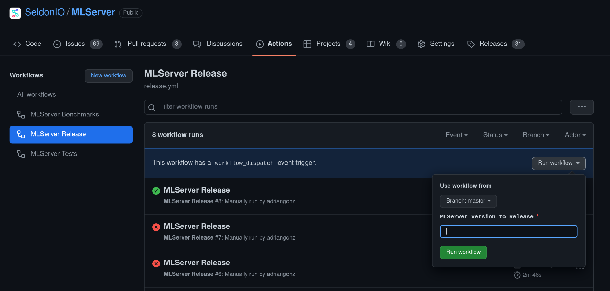
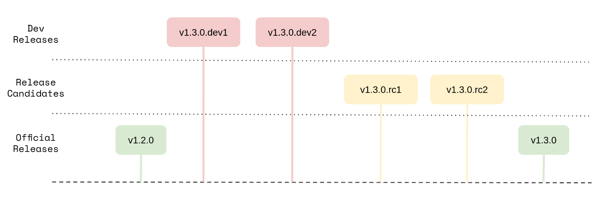

# Release Process

This document discusses the release process for MLServer.

> :warning: **NOTE:** This is work in progress.
> This is a very initial version of the release process.
> The process may change. Please, always check this document before conducting
> a release and verify if everything goes as expected.

## Process Summary

1. Trigger a `MLServer Release` from Github Actions.

   1. Provide the [version tag](versioning-scheme) that you want to release.
      

2. Monitor the triggered workflow, until it's finished.

   1. Once it's done, all the [release artifacts](release-artifacts) will be
      pushed to Docker Hub and PyPI.
   2. Additionally, a release draft will get created in the repository
      [Releases section](https://github.com/SeldonIO/MLServer/releases).

## Versioning Scheme

The MLServer project publishes three types of release versions:

- **Dev pre-releases**, used to test new features before an official release.
  They will follow the schema `<next-minor-version>.dev<incremental-index>`
  (e.g. `1.2.0.dev3`).
- **Release candidates**, used to test an official release before the actual
  release occurs.
  This type of releases can be useful to test minor releases across different
  projects. They follow the schema `<next-minor-version>.rc<incremental-index>`
  (e.g. `1.2.0.rc1`).
- **Official releases**, used only for actual public releases. The version tag
  will only contain the next minor version (e.g. `1.2.0`), without any
  suffixes.

Based on the above, a usual release cycle between two official releases would
generally look like the following (where stability increases as you go down on
the chart):

## Release Artefacts

Each release of MLServer will build and publish a set of artifacts, both at the
runtime level and the wider MLServer level:

- Docker image containing every inference runtime maintained within the
  MLServer repo, tagged as `seldonio/mlserver:<version>` (e.g.
  `seldonio/mlserver:1.2.0`).
  Note that this image can grow quite large.
- _Slim_ Docker image containing only the core MLServer package (i.e. without
  any runtimes), tagged as `seldonio/mlserver:<version>-slim` (e.g.
  `seldonio/mlserver:1.2.0-slim`).
  This image is used, as the default for custom runtimes.
- Python package for the core MLServer modules (i.e. without any runtime),
  which will get published in PyPI, named simply `mlserver`.
- For each inference runtime (e.g. `mlserver-sklearn`, `mlserver-xgboost`,
  etc.):
  - Docker image containing only that specific runtime, tagged as
    `seldonio/mlserver:<version>-<runtime>` (e.g.
    `seldonio/mlserver:1.2.0-sklearn`).
  - Python package for the specific runtime, which will get published in PyPI
    (e.g. `mlserver-sklearn==1.2.0`).
