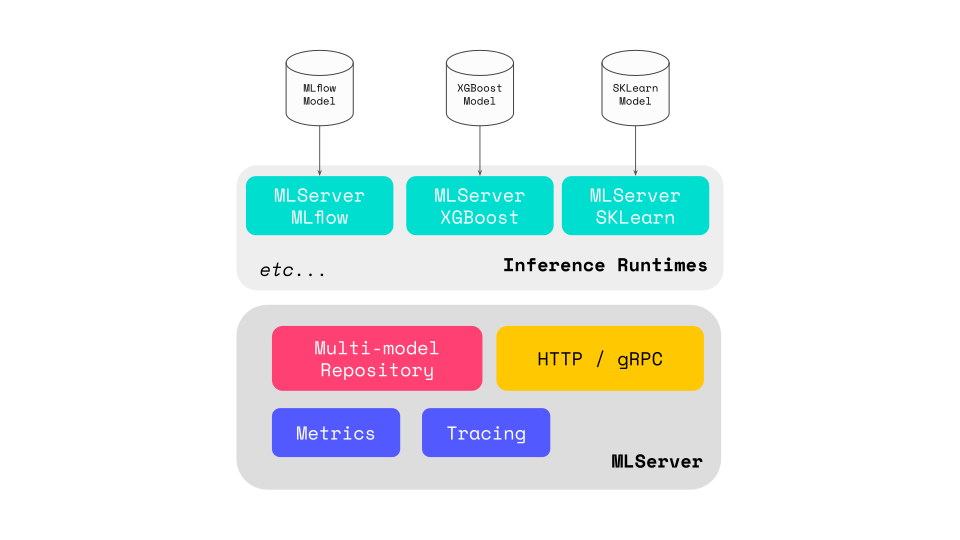

# Inference Runtimes

Inference runtimes allow you to define how your model should be used within
MLServer.
You can think of them as the **backend glue** between MLServer and your machine
learning framework of choice.

Out of the box, MLServer comes with a set of pre-packaged runtimes which let
you interact with a subset of common ML frameworks.
This allows you to start serving models saved in these frameworks straight
away.
To avoid bringing in dependencies for frameworks that you don't need to use,
these runtimes are implemented as independent (and optional) Python packages.
This mechanism also allows you to **rollout your [own custom runtimes](./custom.md) very easily**.

To pick which runtime you want to use for your model, you just need to make
sure that the right package is installed, and then point to the correct runtime
class in your `model-settings.json` file.

## Included Inference Runtimes

| Framework  | Package Name | Implementation Class  | Example | Documentation   |
| ----------- | ----------- | --------------- | --------- | ------------------- |
| Scikit-Learn | `mlserver-sklearn` | `mlserver_sklearn.SKLearnModel` | [Scikit-Learn example](../examples/sklearn/README.md)      | [MLServer SKLearn](./sklearn.md)      |
| XGBoost      | `mlserver-xgboost`      | `mlserver_xgboost.XGBoostModel`            | [XGBoost example](../examples/xgboost/README.md)           | [MLServer XGBoost](./xgboost.md)                                    |
| Spark MLlib  | `mlserver-mllib`        | `mlserver_mllib.MLlibModel`                | [MLlib example](../examples/mllib/README.md)            | [MLServer MLlib](./mllib.md) |
| LightGBM     | `mlserver-lightgbm`     | `mlserver_lightgbm.LightGBMModel`          | [LightGBM example](../examples/lightgbm/README.md)         | [MLServer LightGBM](./lightgbm.md)   |
| CatBoost     | `mlserver-catboost`     | `mlserver_catboost.CatboostModel`          | [CatBoost example](../examples/catboost/README.md)         | [MLServer CatBoost](./catboost.md)  |
| MLflow       | `mlserver-mlflow`       | `mlserver_mlflow.MLflowRuntime`            | [MLflow example](../examples/mlflow/README.md)             | [MLServer MLflow](./mlflow.md) |
| Alibi-Detect | `mlserver-alibi-detect` | `mlserver_alibi_detect.AlibiDetectRuntime` | [Alibi-detect example](../examples/alibi-detect/README.md) | [MLServer Alibi-Detect](./alibi-detect.md)  |