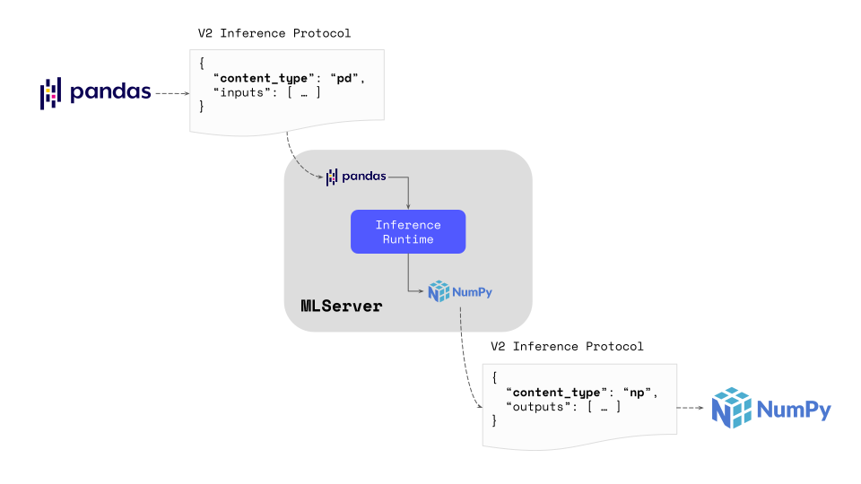
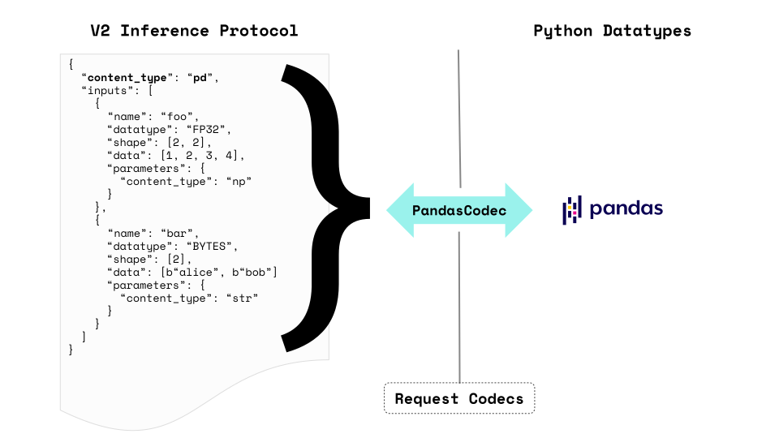

# Content Types (and Codecs)

Machine learning models generally expect their inputs to be passed down as a
particular Python type.
Most commonly, this type ranges from _"general purpose"_ NumPy arrays or Pandas
DataFrames to more granular definitions, like `datetime` objects, `Pillow`
images, etc.
Unfortunately, the definition of the [V2 Inference
Protocol](https://docs.seldon.io/projects/seldon-core/en/latest/reference/apis/v2-protocol.html) doesn't
cover any of the specific use cases.
This protocol can be thought of a wider _"lower level"_ spec, which only
defines what fields a payload should have.

To account for this gap, MLServer introduces support for **content types**,
which offer a way to let MLServer know how it should _"decode"_ V2-compatible
payloads.
When shaped in the right way, these payloads should _"encode"_ all the
information required to extract the higher level Python type that will be
required for a model.

To illustrate the above, we can think of a Scikit-Learn pipeline, which takes
in a Pandas DataFrame and returns a NumPy Array.
Without the use of **content types**, the V2 payload itself would probably lack
information about how this payload should be treated by MLServer
Likewise, the Scikit-Learn pipeline wouldn't know how to treat a raw V2
payload.
In this scenario, the use of content types allows us to specify information on
what's the actual _"higher level"_ information encoded within the V2 protocol
payloads.



## Usage

```{note}
Some inference runtimes may apply a content type by default if none is present.
To learn more about each runtime's defaults, please check the [relevant
inference runtime's docs](../runtimes/index).
```

To let MLServer know that a particular payload must be decoded / encoded as a
different Python data type (e.g. NumPy Array, Pandas DataFrame, etc.), you can
specifity it through the `content_type` field of the `parameters` section of
your request.

As an example, we can consider the following dataframe, containing two columns:
Age and First Name.

| First Name | Age |
| ---------- | --- |
| Joanne     | 34  |
| Michael    | 22  |

This table, could be specified in the V2 protocol as the following payload, where we declare that:

- The whole set of inputs should be decoded as a Pandas Dataframe (i.e. setting
  the content type as `pd`).
- The First Name column should be decoded as a UTF-8 string (i.e. setting the content
  type as `str`).

```{code-block} json
---
emphasize-lines: 2-4, 9-11
---
{
  "parameters": {
    "content_type": "pd"
  },
  "inputs": [
    {
      "name": "First Name",
      "datatype": "BYTES",
      "parameters": {
        "content_type": "str"
      },
      "shape": [2],
      "data": ["Joanne", "Michael"]
    },
    {
      "name": "Age",
      "datatype": "INT32",
      "shape": [2],
      "data": [34, 22]
    },
  ]
}
```

To learn more about the available content types and how to use them, you can
see all the available ones in the [Available Content
Types](#available-content-types) section below.

```{note}
It's important to keep in mind that content types can be specified at both the
**request level** and the **input level**.
The former will apply to the **entire set of inputs**, whereas the latter will
only apply to a **particular input** of the payload.
```

### Codecs

Under the hood, the conversion between content types is implemented using
_codecs_.
In the MLServer architecture, codecs are an abstraction which know how to
_encode_ and _decode_ high-level Python types to and from the V2 Inference
Protocol.

Depending on the high-level Python type, encoding / decoding operations may
require access to multiple input or output heads.
For example, a Pandas Dataframe would need to aggregate all of the
input-/output-heads present in a V2 Inference Protocol response.



However, a Numpy array or a list of strings, could be encoded directly as an
input head within a larger request.


To account for this, codecs can work at either the request- / response-level
(known as **request codecs**), or the input- / output-level (known as **input
codecs**).
Each of these codecs, expose the following **public interface**, where `Any`
represents a high-level Python datatype (e.g. a Pandas Dataframe, a Numpy
Array, etc.):

- **Request Codecs**
  - {func}`encode_request() <mlserver.codecs.RequestCodec.encode_request>`
  - {func}`decode_request() <mlserver.codecs.RequestCodec.decode_request>`
  - {func}`encode_response() <mlserver.codecs.RequestCodec.encode_response>`
  - {func}`decode_response() <mlserver.codecs.RequestCodec.decode_response>`
- **Input Codecs**
  - {func}`encode_input() <mlserver.codecs.InputCodec.encode_input>`
  - {func}`decode_input() <mlserver.codecs.InputCodec.decode_input>`
  - {func}`encode_output() <mlserver.codecs.InputCodec.encode_output>`
  - {func}`decode_output() <mlserver.codecs.InputCodec.decode_output>`

Note that, these methods can also be used as helpers to **encode requests and
decode responses on the client side**.
This can help to abstract away from the user most of the details about the
underlying structure of V2-compatible payloads.

For example, in the example above, we could use codecs to encode the DataFrame
into a V2-compatible request simply as:

```python
import pandas as pd

from mlserver.codecs import PandasCodec

dataframe = pd.DataFrame({'First Name': ["Joanne", "Michael"], 'Age': [34, 22]})

inference_request = PandasCodec.encode_request(dataframe)
print(inference_request)
```

For a full end-to-end example on how content types and codecs work under the
hood, feel free to check out this [Content Type Decoding
example](../examples/content-type/README.md).

#### Converting to / from JSON

When using MLServer's request codecs, the output of encoding payloads will
always be one of the classes within the `mlserver.types` package (i.e.
{class}`InferenceRequest <mlserver.types.InferenceRequest>` or
{class}`InferenceResponse <mlserver.types.InferenceResponse>`).
Therefore, if you want to use them with `requests` (or other package outside of
MLServer) you will need to **convert them to a Python dict or a JSON string**.

Luckily, these classes leverage [Pydantic](https://docs.pydantic.dev/latest/)
under the hood.
Therefore you can just call the `.model_dump()` or `.model_dump_json()` method to convert them.
Likewise, to read them back from JSON, we can always pass the JSON fields as
kwargs to the class' constructor (or use any of the [other
methods](https://docs.pydantic.dev/latest/usage/models/#model-properties)
available within Pydantic).

For example, if we want to send an inference request to model `foo`, we could
do something along the following lines:

```{code-block} python
---
emphasize-lines: 10-11, 15-18
---
import pandas as pd
import requests

from mlserver.codecs import PandasCodec

dataframe = pd.DataFrame({'First Name': ["Joanne", "Michael"], 'Age': [34, 22]})

inference_request = PandasCodec.encode_request(dataframe)

# raw_request will be a Python dictionary compatible with `requests`'s `json` kwarg
raw_request = inference_request.dict()

response = requests.post("localhost:8080/v2/models/foo/infer", json=raw_request)

# raw_response will be a dictionary (loaded from the response's JSON),
# therefore we can pass it as the InferenceResponse constructors' kwargs
raw_response = response.json()
inference_response = InferenceResponse(**raw_response)
```

#### Support for NaN values

The NaN (Not a Number) value is used in Numpy and other scientific libraries to
describe an invalid or missing value (e.g. a division by zero).
In some scenarios, it may be desirable to let your models receive and / or
output NaN values (e.g. these can be useful sometimes with GBTs, like XGBoost
models).
This is why MLServer supports encoding NaN values on your request / response
payloads under some conditions.

In order to send / receive NaN values, you must ensure that:

- You are using the `REST` interface.
- The input / output entry containing NaN values uses either the `FP16`, `FP32`
  or `FP64` datatypes.
- You are either using the [Pandas codec](#pandas-dataframe) or the [Numpy
  codec](#numpy-array).

Assuming those conditions are satisfied, any `null` value within your tensor
payload will be converted to NaN.

For example, if you take the following Numpy array:

```python
import numpy as np

foo = np.array([[1.2, 2.3], [np.NaN, 4.5]])
```

We could encode it as:

```{code-block} json
---
emphasize-lines: 8
---
{
  "inputs": [
    {
      "name": "foo",
      "parameters": {
        "content_type": "np"
      },
      "data": [1.2, 2.3, null, 4.5]
      "datatype": "FP64",
      "shape": [2, 2],
    }
  ]
}
```


### Model Metadata

Content types can also be defined as part of the [model's
metadata](../reference/model-settings).
This lets the user pre-configure what content types should a model use by
default to decode / encode its requests / responses, without the need to
specify it on each request.

For example, to configure the content type values of the [example
above](#usage), one could create a `model-settings.json` file like the one
below:

```{code-block} json
---
emphasize-lines: 2-4, 9-11
caption: model-settings.json
---
{
  "parameters": {
    "content_type": "pd"
  },
  "inputs": [
    {
      "name": "First Name",
      "datatype": "BYTES",
      "parameters": {
        "content_type": "str"
      },
      "shape": [-1],
    },
    {
      "name": "Age",
      "datatype": "INT32",
      "shape": [-1],
    },
  ]
}
```

It's important to keep in mind that content types passed explicitly as part of
the request will always **take precedence over the model's metadata**.
Therefore, we can leverage this to override the model's metadata when needed.

## Available Content Types

Out of the box, MLServer supports the following list of content types.
However, this can be extended through the use of 3rd-party or custom runtimes.

| Python Type                           | Content Type | Request Level | Request Codec                               | Input Level | Input Codec                     |
| ------------------------------------- | ------------ | ------------- | ------------------------------------------- | ----------- | ------------------------------- |
| [NumPy Array](#numpy-array)           | `np`         | ✅            | `mlserver.codecs.NumpyRequestCodec`         | ✅          | `mlserver.codecs.NumpyCodec`    |
| [Pandas DataFrame](#pandas-dataframe) | `pd`         | ✅            | `mlserver.codecs.PandasCodec`               | ❌          |                                 |
| [UTF-8 String](#utf-8-string)         | `str`        | ✅            | `mlserver.codecs.string.StringRequestCodec` | ✅          | `mlserver.codecs.StringCodec`   |
| [Base64](#base64)                     | `base64`     | ❌            |                                             | ✅          | `mlserver.codecs.Base64Codec`   |
| [Datetime](#datetime)                 | `datetime`   | ❌            |                                             | ✅          | `mlserver.codecs.DatetimeCodec` |

```{note}
MLServer allows you extend the supported content types by **adding custom
ones**.
To learn more about how to write your own custom content types, you can check
this [full end-to-end example](../examples/content-type/README.md).
You can also learn more about building custom extensions for MLServer on the
[Custom Inference Runtime section](../runtimes/custom) of the docs.
```

### NumPy Array

```{note}
The [V2 Inference
Protocol](https://docs.seldon.io/projects/seldon-core/en/latest/reference/apis/v2-protocol.html) expects
that the `data` of each input is sent as a **flat array**.
Therefore, the `np` content type will expect that tensors are sent flattened.
The information in the `shape` field will then be used to reshape the vector
into the right dimensions.
```

The `np` content type will decode / encode V2 payloads to a NumPy Array, taking
into account the following:

- The `datatype` field will be matched to the closest [NumPy
  `dtype`](https://numpy.org/doc/stable/reference/arrays.dtypes.html).
- The `shape` field will be used to reshape the flattened array expected by the
  V2 protocol into the expected tensor shape.

```{note}
By default, MLServer will always assume that an array with a single-dimensional
shape, e.g. `[N]`, is equivalent to `[N, 1]`.
That is, each entry will be treated like a single one-dimensional data point
(i.e. instead of a `[1, D]` array, where the full array is a single
`D`-dimensional data point).
To avoid any ambiguity, where possible, the **Numpy codec will always
explicitly encode `[N]` arrays as `[N, 1]`**.
```

For example, if we think of the following NumPy Array:

```python
import numpy as np

foo = np.array([[1, 2], [3, 4]])
```

We could encode it as the input `foo` in a V2 protocol request as:

`````{tab-set}
````{tab-item} JSON payload
```{code-block} json
---
emphasize-lines: 8-10
---
{
  "inputs": [
    {
      "name": "foo",
      "parameters": {
        "content_type": "np"
      },
      "data": [1, 2, 3, 4]
      "datatype": "INT32",
      "shape": [2, 2],
    }
  ]
}
```
````

````{tab-item} NumPy Request Codec
```{code-block} python
---
emphasize-lines: 1,4
---
from mlserver.codecs import NumpyRequestCodec

# Encode an entire V2 request
inference_request = NumpyRequestCodec.encode_request(foo)
```
````

````{tab-item} NumPy Input Codec
```{code-block} python
---
emphasize-lines: 2,8
---
from mlserver.types import InferenceRequest
from mlserver.codecs import NumpyCodec

# We can use the `NumpyCodec` to encode a single input head with name `foo`
# within a larger request
inference_request = InferenceRequest(
  inputs=[
    NumpyCodec.encode_input("foo", foo)
  ]
)
```
````

`````

When using the NumPy Array content type at the **request-level**, it will decode
the entire request by considering only the first `input` element.
This can be used as a helper for models which only expect a single tensor.

### Pandas DataFrame

```{note}
The `pd` content type can be _stacked_ with other content types.
This allows the user to use a different set of content types to decode each of
the columns.
```

The `pd` content type will decode / encode a V2 request into a Pandas
DataFrame.
For this, it will expect that the DataFrame is shaped in a **columnar way**.
That is,

- Each entry of the `inputs` list (or `outputs`, in the case of
  responses), will represent a column of the DataFrame.
- Each of these entires, will contain all the row elements for that particular
  column.
- The `shape` field of each `input` (or `output`) entry will contain (at least)
  the amount of rows included in the dataframe.

For example, if we consider the following dataframe:

| A   | B   | C   |
| --- | --- | --- |
| a1  | b1  | c1  |
| a2  | b2  | c2  |
| a3  | b3  | c3  |
| a4  | b4  | c4  |

We could encode it to the V2 Inference Protocol as:

`````{tab-set}
````{tab-item} JSON Payload
```{code-block} json
---
emphasize-lines: 3, 7-8, 13-14, 19-20
---
{
  "parameters": {
    "content_type": "pd"
  },
  "inputs": [
    {
      "name": "A",
      "data": ["a1", "a2", "a3", "a4"]
      "datatype": "BYTES",
      "shape": [4],
    },
    {
      "name": "B",
      "data": ["b1", "b2", "b3", "b4"]
      "datatype": "BYTES",
      "shape": [4],
    },
    {
      "name": "C",
      "data": ["c1", "c2", "c3", "c4"]
      "datatype": "BYTES",
      "shape": [4],
    },
  ]
}
```
````

````{tab-item} Pandas Request Codec
```{code-block} python
---
emphasize-lines: 3,11
---
import pandas as pd

from mlserver.codecs import PandasCodec

foo = pd.DataFrame({
  "A": ["a1", "a2", "a3", "a4"],
  "B": ["b1", "b2", "b3", "b4"],
  "C": ["c1", "c2", "c3", "c4"]
})

inference_request = PandasCodec.encode_request(foo)
```
````
`````

### UTF-8 String

The `str` content type lets you encode / decode a V2 input into a UTF-8
Python string, taking into account the following:

- The expected `datatype` is `BYTES`.
- The `shape` field represents the number of "strings" that are encoded in
  the payload (e.g. the `["hello world", "one more time"]` payload will have a
  shape of 2 elements).

For example, when if we consider the following list of strings:

```python
foo = ["bar", "bar2"]
```

We could encode it to the V2 Inference Protocol as:

`````{tab-set}
````{tab-item} JSON Payload
```{code-block} json
---
emphasize-lines: 3,7-8
---
{
  "parameters": {
    "content_type": "str"
  },
  "inputs": [
    {
      "name": "foo",
      "data": ["bar", "bar2"]
      "datatype": "BYTES",
      "shape": [2],
    }
  ]
}
```
````

````{tab-item} String Request Codec
```{code-block} python
---
emphasize-lines: 1,4
---
from mlserver.codecs.string import StringRequestCodec

# Encode an entire V2 request
inference_request = StringRequestCodec.encode_request(foo, use_bytes=False)
```
````

````{tab-item} String Input Codec
```{code-block} python
---
emphasize-lines: 2,8
---
from mlserver.types import InferenceRequest
from mlserver.codecs import StringCodec

# We can use the `StringCodec` to encode a single input head with name `foo`
# within a larger request
inference_request = InferenceRequest(
  inputs=[
    StringCodec.encode_input("foo", foo, use_bytes=False)
  ]
)
```
````
`````

When using the `str` content type at the request-level, it will decode the
entire request by considering only the first `input` element.
This can be used as a helper for models which only expect a single string or a
set of strings.

### Base64

The `base64` content type will decode a binary V2 payload into a Base64-encoded
string (and viceversa), taking into account the following:

- The expected `datatype` is `BYTES`.
- The `data` field should contain the base64-encoded binary strings.
- The `shape` field represents the number of binary strings that are encoded in
  the payload.

For example, if we think of the following _"bytes array"_:

```python
foo = b"Python is fun"
```

We could encode it as the input `foo` of a V2 request as:

`````{tab-set}

````{tab-item} JSON Payload
```{code-block} json
---
emphasize-lines: 8-10
---
{
  "inputs": [
    {
      "name": "foo",
      "parameters": {
        "content_type": "base64"
      },
      "data": ["UHl0aG9uIGlzIGZ1bg=="]
      "datatype": "BYTES",
      "shape": [1],
    }
  ]
}
```
````

````{tab-item} Base64 Input Codec
```{code-block} python
---
emphasize-lines: 2,8
---
from mlserver.types import InferenceRequest
from mlserver.codecs import Base64Codec

# We can use the `Base64Codec` to encode a single input head with name `foo`
# within a larger request
inference_request = InferenceRequest(
  inputs=[
    Base64Codec.encode_input("foo", foo, use_bytes=False)
  ]
)
```
````
`````

### Datetime

The `datetime` content type will decode a V2 input into a [Python
`datetime.datetime`
object](https://docs.python.org/3/library/datetime.html#datetime.datetime),
taking into account the following:

- The expected `datatype` is `BYTES`.
- The `data` field should contain the dates serialised following the [ISO 8601
  standard](https://en.wikipedia.org/wiki/ISO_8601).
- The `shape` field represents the number of datetimes that are encoded in
  the payload.

For example, if we think of the following `datetime` object:

```python
import datetime

foo = datetime.datetime(2022, 1, 11, 11, 0, 0)
```

We could encode it as the input `foo` of a V2 request as:

`````{tab-set}

````{tab-item} JSON Payload
```{code-block} json
---
emphasize-lines: 8-10
---
{
  "inputs": [
    {
      "name": "foo",
      "parameters": {
        "content_type": "datetime"
      },
      "data": ["2022-01-11T11:00:00"]
      "datatype": "BYTES",
      "shape": [1],
    }
  ]
}
```
````

````{tab-item} Datetime Input Codec
```{code-block} python
---
emphasize-lines: 2,8
---
from mlserver.types import InferenceRequest
from mlserver.codecs import DatetimeCodec

# We can use the `DatetimeCodec` to encode a single input head with name `foo`
# within a larger request
inference_request = InferenceRequest(
  inputs=[
    DatetimeCodec.encode_input("foo", foo, use_bytes=False)
  ]
)
```
````
`````
