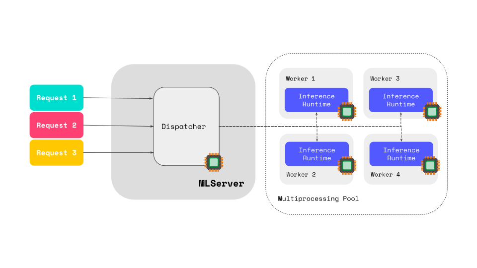

# Parallel Inference

Out of the box, MLServer includes support to offload inference workloads to a
pool of workers running in separate processes.
This allows MLServer to scale out beyond the limitations of the Python
interpreter.
To learn more about why this can be beneficial, you can check the [concurrency
section](#Concurrency-in-Python) below.

By default, MLServer will spin up a pool of 4 workers for each loaded model.
To read more about advanced settings, please see the [usage section
below](#Usage).

## Concurrency in Python

The [Global Interpreter Lock
(GIL)](https://wiki.python.org/moin/GlobalInterpreterLock) is a mutex lock that
exists in most Python interpreters (e.g. CPython).
Its main purpose is to lock Python’s execution so that it only runs on a single
processor at the same time.
This simplifies certain things to the interpreter.
However, it also adds the limitation that a **single Python process will never
be able to leverage multiple cores**.

When we think about MLServer's support for [Multi-Model Serving
(MMS)](../examples/mms/README.md), this could lead to scenarios where a
**heavily-used model starves the other models** running within the same
MLServer instance.
Similarly, even if we don’t take MMS into account, the **GIL also makes it harder
to scale inference for a single model**.

To work around this limitation, MLServer offloads the model inference to a pool
of workers, where each worker is a separate process (and thus has its own
separate GIL).
This means that we can get full access to the underlying hardware.

## Usage

By default, MLServer will always create an inference pool with 4 workers for
each loaded model.
This behaviour can be tweaked for eacn independent model through the settings
below.

### `parallel_workers`

The `parallel_workers` field of the `model-settings.json` file (or
alternatively, the `MLSERVER_MODEL_PARALLEL_WORKERS` global environment
variable) controls the size of each inference pool.
The expected values are:

- `N`, where `N > 0`, will create a pool of `N` workers.
- `0`, will disable the parallel inference feature.
  In other words, inference will happen within the main MLServer process.
